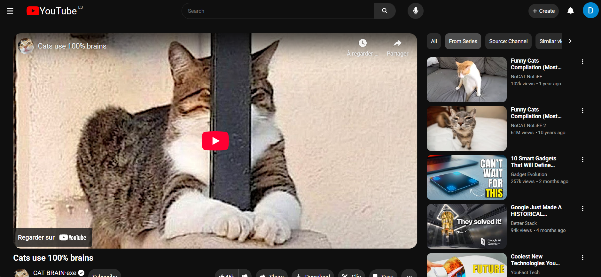

# Youtube Frontend Clone


A responsive YouTube inspired frontend clone built with React and Vite.  

This project recreates the YouTube browsing and watch experience, with a focus on UI architecture, responsive design, reusable components, accessibility, and serverless API integration.

Live demo: [youtube-frontendclone.netlify.app](https://youtube-frontendclone.netlify.app/home)

Recorded overview on YouTube: [Watch here](https://www.youtube.com/watch?v=zsUIJyR5Ejk)

## Screenshot




## Features

- Responsive home and watch pages

- Dynamic video and channel data from the YouTube API

- Serverless Netlify function to protect API keys

- React Query for data fetching and caching

- Reusable component architecture

- Custom hooks for:

    - Click outside detection   
    - Escape key handling
    - Focus restoration
    - Body scroll locking
    - Media queries
    - Inert background behavior
    - Keyboard navigation

- Demo mode feedback for non-implemented actions

- Local mock comment data for a fuller viewing experience

## Tech Stack

- React
- Vite
- React Router
- TanStack React Query
- Netlify Functions
- Font Awesome
- CSS
- Floating UI
- Radix Focus Scope

## Project Goals

The goal of this project was not only to reproduce the look of YouTube, but also to practice building a medium-sized frontend application with:

- reusable UI components

- responsive layout patterns

- API integration

- custom interaction hooks

- accessibility focused behavior

- cleaner separation between frontend and serverless backend logic

## Run Locally

This project uses a Netlify Function to proxy YouTube API requests, so local development should be started with Netlify Dev.

### 1. Install dependencies

```bash
npm install
```

### 2. Create a .env file in the project root

```env
YOUTUBE_API_KEY=your_own_youtube_api_key
```

### 3. Start the development server

```bash
npm run dev
```

## Notes


- `npm run dev` uses `netlify dev` so the frontend and Netlify Functions work together locally.

- A personal YouTube API key is required to run the project locally.

- The API key is never exposed in the frontend source code.


## What I Learned

- How to structure a medium-sized React project

- How to separate UI logic from reusable hooks

- How to manage remote state with React Query

- How to improve keyboard and focus accessibility in interactive components

- How to use Netlify Functions to keep API keys out of the client

## Future Improvements

- Migrate to TypeScript

- Refactor and further optimize the codebase

- Update and sanitize CSS system within ListVideoCard

- Convert click outside logic to a clickable invisible overlay

- Improve error handling across the app
